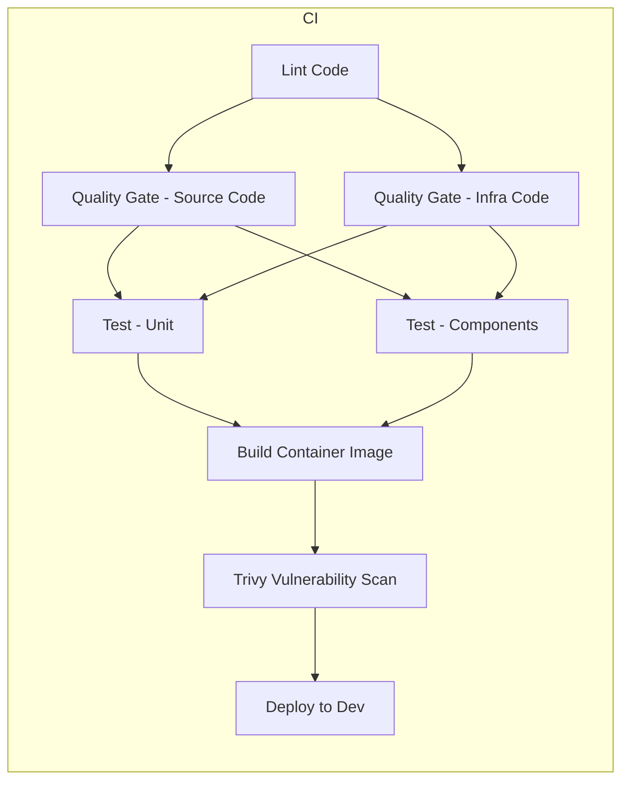

# Digital Step Flow - Frontend

Frontend React da plataforma Digital Step Flow.

## Stack Tecnológico

- React 18 com TypeScript
- Vite para build
- React Router para navegação
- TanStack Query para busca de dados
- Tailwind CSS para estilização
- React Hook Form + Zod para validação

## Desenvolvimento Local

### Docker Compose (backend + frontend + Postgres + Redis + observabilidade)

O Docker Compose fica no repositório do **backend** e sobe backend, frontend, Postgres, Redis, Prometheus, Grafana, Loki e Tempo.

**Pré-requisitos:** Docker e Docker Compose instalados. Ter os dois repositórios (backend e frontend) clonados.

**1. Estrutura de pastas**

Clone o **frontend** ao lado do **backend** (mesmo diretório pai):

```bash
# Exemplo: backend em ~/git/pucrs-tcc-digital-step-flow-backend
cd ~/git
git clone <url-do-repo-frontend> pucrs-tcc-digital-step-flow-frontend
# Resultado:
# ~/git/pucrs-tcc-digital-step-flow-backend/
# ~/git/pucrs-tcc-digital-step-flow-frontend/
```

**2. Subir a stack completa**

No repositório do **backend** (não no frontend):

```bash
cd pucrs-tcc-digital-step-flow-backend
cp env.example .env   # opcional
docker compose up -d
```

**3. Frontend em container**

O frontend sobe junto e fica em **http://localhost:3000**. O backend em http://localhost:8080.

**4. Frontend local (npm) + backend em Docker**

Se preferir rodar o frontend com `npm run dev` (hot reload) e o resto em Docker:

No **backend**:

```bash
docker compose -f docker-compose.backend-only.yml up -d
```

Neste repositório (frontend):

```bash
npm install
echo "VITE_API_BASE_URL=http://localhost:8080/api" > .env
npm run dev
```

Frontend: http://localhost:3000 | Backend API: http://localhost:8080

**URLs úteis**

| Serviço      | URL                         |
|--------------|-----------------------------|
| Frontend     | http://localhost:3000        |
| Backend API  | http://localhost:8080        |
| Grafana      | http://localhost:3001       |
| Prometheus   | http://localhost:9090       |

Mais detalhes: [Backend – Desenvolvimento Local](https://github.com/raphaelmoraes/pucrs-tcc-digital-step-flow-backend/blob/main/docs/local-development.md) e [docs/local-development.md](./docs/local-development.md).

### Como desenvolver o frontend (sem Docker)

1. **Pré-requisitos:** Node.js v24.13.0, npm 11.6.3. Opcional: Docker.
2. **Instale dependências e suba o servidor de desenvolvimento:**

```bash
npm install
npm run dev
```

O frontend estará em **http://localhost:3000**. Crie um `.env` na raiz com `VITE_API_BASE_URL=http://localhost:8080/api` (veja [docs/local-development.md](./docs/local-development.md) ou `env.example`).

3. **Scripts úteis:**

```bash
npm run dev          # Desenvolvimento (Vite HMR)
npm run build        # Build para produção
npm run preview      # Preview do build
npm test             # Testes
npm run lint         # Linter
```

### Desenvolvendo frontend e backend juntos

- **Backend:** no repositório [pucrs-tcc-digital-step-flow-backend](https://github.com/raphaelmoraes/pucrs-tcc-digital-step-flow-backend), `npm run dev` → http://localhost:8080  
- **Frontend:** `npm run dev` neste repositório → http://localhost:3000  
- No frontend, use `VITE_API_BASE_URL=http://localhost:8080/api` no `.env` para consumir o backend local.

## Estrutura do Projeto

```
src/
├── pages/          # Páginas da aplicação
│   ├── auth/      # Páginas de autenticação
│   ├── dashboard/ # Dashboard
│   ├── onboarding/# Onboarding
│   └── subscription/ # Assinaturas
├── services/      # Serviços de API
├── contexts/      # Contextos React
├── routes/        # Configuração de rotas
└── App.tsx        # Componente principal
```

## Kubernetes

Os manifests Kubernetes estão em `k8s/` e incluem:
- Deployment
- Service
- Kustomization (usa remote base do repositório principal)

## Argo CD

A application do Argo CD está em `argocd/application.yaml` e aponta para este repositório.

## Build Docker

```bash
# Build local
docker buildx bake -f docker-bake.hcl --load

# Build com versão específica
docker buildx bake -f docker-bake.hcl --load \
  --set frontend.args.FRONTEND_IMAGE_VERSION=1.0.0 \
  --set frontend.args.BASE_IMAGE_VERSION=1.0.0
```

## Versionamento

Este projeto segue [Semantic Versioning 2.0.0](https://semver.org/).

Para criar uma release:
```bash
git tag -a v1.0.0 -m "Release version 1.0.0"
git push origin v1.0.0
```

## GitHub Actions

### Diagrama do pipeline CI

O pipeline CI (`.github/workflows/ci.yml`) roda em **push** e **pull_request** para `develop` e em tags `v*.*.*`:



| Job | Descrição |
|-----|-----------|
| **Lint Code** | ESLint no código TypeScript/JavaScript. |
| **Quality Gate - Source Code** | MegaLinter em código (JS/TS/Bash). |
| **Quality Gate - Infra Code** | MegaLinter em k8s, Dockerfile, YAML; KICS, Checkov, Trivy em infra. |
| **Test - Unit** | Testes unitários com cobertura; upload para Codecov. |
| **Test - Components** | Testes de componentes com cobertura; upload para Codecov. |
| **Build Container Image** | Determina versão (branch/tag), build e push da imagem Docker. |
| **Trivy Vulnerability Scan** | Escaneia a imagem construída (CRITICAL/HIGH). |
| **Deploy to Dev** | Só em push para `develop`: atualiza manifests k8s de dev com a nova tag. |

### CD (Deploy)

- **Deploy to Dev:** job `deploy-dev` dentro do próprio `ci.yml`; roda apenas em push para `develop` (após Trivy) e atualiza os manifests Kubernetes de dev com a nova tag da imagem.
- **CD Deploy PROD** (`cd-deploy-prod.yml`): workflow dedicado para deploys de produção (ex.: tag ou manual).

## Documentação

- [Desenvolvimento Local](./docs/local-development.md)
- [Versionamento](./docs/versioning.md)
